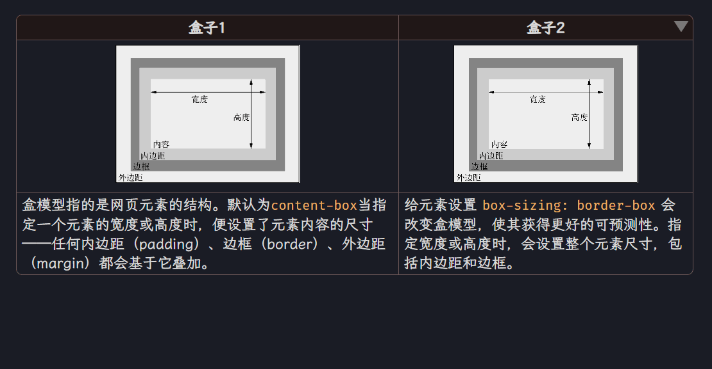

# Table Collapse Plugin

在Obsidian的表格中添加一个折叠按钮，允许用户折叠和展开表格的内容。

## 特性

- 在表格的`thead`中自动添加折叠按钮。
- 点击按钮可以折叠或展开表格的`tbody`部分。

## 安装

1. 下载或克隆此仓库。
2. 将插件文件夹放置在Obsidian的插件目录中（通常是`<vault>/.obsidian/plugins/`）。
3. 打开Obsidian，进入设置 -> 第三方插件，启用`Table Collapse Plugin`。

## 使用

插件启用后，它会自动在所有表格的`thead`中添加一个折叠按钮。点击按钮可以折叠或展开表格的`tbody`部分。
